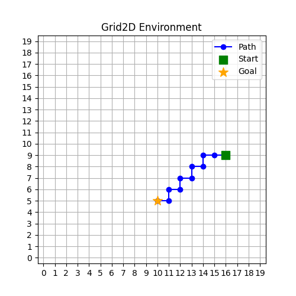

# IsaacLab Tutorial

This tutorial provides a comprehensive guide to getting started with [IsaacLab](https://isaac-sim.github.io/IsaacLab/main/index.html), NVIDIA's robotics simulation framework. Learn how to set up your environment, create custom environments, and train reinforcement learning agents using this powerful simulation platform.

<div style="text-align: center;">
  
</div>

*The Grid2D Environment: A simple 2D grid-based path planning task where an agent (green square) must navigate (blue path) to a randomly positioned goal (yellow star) as fast as possible.*

## 1. Installation

See the [official documentation](https://isaac-sim.github.io/IsaacLab/main/source/setup/installation/index.html) for further help.

### 1.1. (Recommended) Pip + Source

* Clone this repository:

    ```bash
    git clone git@github.com:danifuertes/isaaclab-tutorial.git
    cd isaac-tutorial
    ```

* Create a virtual environment with `python3.11`:

    ```bash
    python3.11 -m venv venv
    source venv/bin/activate
    pip install --upgrade pip setuptools wheel
    ```

* Install `isaacsim` and its dependencies:
    ```bash
    pip install "isaacsim[all,extscache]==5.0.0" --extra-index-url https://pypi.nvidia.com
    ```

* Install `isaaclab` and its dependencies:
    ```bash
    sudo apt install cmake build-essential # -> If not installed
    git clone git@github.com:isaac-sim/IsaacLab.git
    IsaacLab/isaaclab.sh -i
    ```

### 1.2. Pip Only

* Clone this repository:

    ```bash
    git clone git@github.com:danifuertes/isaaclab-tutorial.git
    cd isaac-tutorial
    ```

* Create a virtual environment with `python3.11`:

    ```bash
    python3.11 -m venv venv
    source venv/bin/activate
    pip install --upgrade pip setuptools wheel
    ```

* Install `isaaclab` and `isaacsim` together:
    ```bash
    pip install isaaclab[isaacsim,all]==2.2.0 --extra-index-url https://pypi.nvidia.com
    ```

### 1.3. Docker

* Clone `isaaclab` repository:

    ```bash
    git clone git@github.com:isaac-sim/IsaacLab.git
    cd IsaacLab
    ```

* Create a virtual environment with `python3.11`:

    ```bash
    python3.11 -m venv venv
    source venv/bin/activate
    pip install --upgrade pip setuptools wheel
    ```

* Build the Docker image (you'll be prompted to choose whether to enable X11 forwarding for GUI applications. Your choice will be saved in `docker/.container.cfg`. Delete this file and build again the image to change your decision):
):

    ```bash
    # Optional: Add --suffix <suffix> to build images with unique names
    python docker/container.py start
    ```

* Clone this tutorial repository in the `source/` directory (this folder is mounted as a volume between host and container):

    ```bash
    cd source
    git clone git@github.com:danifuertes/isaaclab-tutorial.git
    cd ..
    ```

* Enter the Docker container and navigate to the tutorial:

    ```bash
    # Optional: Add --suffix <suffix> (if used during image building)
    python docker/container.py enter
    cd source/isaaclab-tutorial
    ```

* Follow the [Usage Section](#2-usage) to run training and evaluation scripts.

* Stop the Docker container when finished:

    ```bash
    # Optional: Add --suffix <suffix> (if used during image building)
    python docker/container.py stop
    ```

## 2. Usage

### 2.1. Training

Train a simple reinforcement learning agent (multilayer perceptron) on the Grid2d environment:

```bash
python train.py --headless --task grid2d-v0 --model mlp
```

For distributed training across multiple GPUs:

```bash
python -m torch.distributed.run \
    --rdzv-endpoint localhost:8000 \
    --nproc-per-node 2 \
    train.py \
    --headless \
    --distributed \
    --task grid2d-v0 \
    --model mlp
```

### 2.2. Evaluation

Test a trained agent using a saved checkpoint:

```bash
python main.py \
    --headless \
    --task grid2d-v0 \
    --model mlp \
    --num_envs 1 \
    --checkpoint logs/grid2d/ppo/<date>/checkpoints/best_agent.pt
```

Replace `<date>` with the actual timestamp folder created during training.

### 2.3. Command Line Options

- `--headless`: Runs the simulation without GUI rendering for faster training and evaluation.
- `--num_envs`: Number of parallel environments (default is 1024).

For complete list of available options, use:
```bash
python train.py -h    # Training options
python main.py -h     # Evaluation options
```

## 3. Creating Custom Environments

This tutorial demonstrates how to create custom environments using IsaacLab and [SKRL](https://skrl.readthedocs.io/en/latest/index.html). The `grid2d-v0` environment serves as an example of a simple 2D grid world implementation where an agent is required to reach the goal as soon as possible.

### 3.1. Environment Structure

Custom environments require three main components:

1. **Environment Configuration (`Grid2DEnvCfg`)**: Inherits from `DirectRLEnvCfg` and defines environment parameters, action/observation spaces, and simulation settings.
2. **Environment Implementation (`Grid2DEnv`)**: Inherits from `DirectRLEnv` and implements the core environment logic.
3. **Environment Registration**: Registers the environment with Gymnasium for use in training.

### 3.2. Key Files

- `envs/grid2d.py`: Contains the environment configuration class and implementation
- `envs/register.py`: Registers the environment with the id `grid2d-v0`
- `envs/agents/skrl_cfg_grid2d.yaml`: Defines the RL agent configuration (training parameters, configuration of logs, etc.)

### 3.3. Environment Configuration (`DirectRLEnvCfg`)

The environment configuration class inherits from `DirectRLEnvCfg` and defines all the mandatory parameters for your environment:

```python
@configclass
class Grid2DEnvCfg(DirectRLEnvCfg):

    # Environment-specific parameters
    grid_size: int = 20
    
    # (Mandatory) Spaces definition
    state_space: int = 0  # For asymmetric actor-critic (0 = not used)
    action_space = Discrete(4)  # Action space
    observation_space = Dict({  # Oobservation space
        "agent": Box(low=0, high=1, shape=(2,), dtype=float),
        "goal": Box(low=0, high=1, shape=(2,), dtype=float),
    })
    
    # (Mandatory) Simulation settings
    num_envs: int = 1024          # Number of parallel environments (batch size)
    env_spacing: float = 22       # Distance between environments
    dt: float = 1/60              # Simulation timestep (seconds per frame)
    decimation: int = 1           # Physics steps per decision step
    episode_length_s: float = 1.0 # Episode duration in seconds
    # └> Max Timesteps = episode_length_s / (decimation * dt)
    
    # (Mandatory) Scene configuration
    sim: SimulationCfg = SimulationCfg(dt=dt, render_interval=decimation)
    scene: InteractiveSceneCfg = InteractiveSceneCfg(num_envs=num_envs, env_spacing=env_spacing)
    
    # Custom reward parameters (to build your reward function)
    reward_weight: float = 1.0
    penalty_weight: float = -0.01
```

### 3.4. Environment Implementation (`DirectRLEnv`)

The environment class inherits from `DirectRLEnv` and must implement the following mandatory functions:

#### `__init__(self, cfg, render_mode, **kwargs)`
Initialize the environment with configuration and setup internal variables.
- **Inputs**: Environment configuration (`cfg`), render mode (`render_mode`), and additional kwargs.
- **Outputs**: None.
- **Requirements**: Call `super().__init__()`, initialize your custom environment-specific variables, initialize logging metrics dictionaries.

#### `_setup_scene(self)`
Configure the simulation scene and clone environments for parallel execution.
- **Inputs**: None (uses `self.scene`).
- **Outputs**: None.
- **Requirements**: Call `self.scene.clone_environments()` and setup any scene-specific assets for `isaacsim`.

#### `_reset_idx(self, env_ids)`
Reset specific environments when episodes end or at initialization.
- **Inputs**: `env_ids` - List/tensor of environment indices to reset (None = all environments).
- **Outputs**: None.
- **Requirements**: Call `super()._reset_idx(env_ids)`, reset environment states, clear episode metrics.

#### `_get_observations(self)`
Return current observations for all environments (it will feed the neural network).
- **Inputs**: None (uses current environment state).
- **Outputs**: Dictionary with observation data matching `observation_space`.
- **Requirements**: Return dict with `'policy'` key containing normalized observations.

#### `_pre_physics_step(self, actions)`
Preprocess and store actions before physics simulation.
- **Inputs**: `actions` - Tensor of actions from the policy.
- **Outputs**: None.
- **Requirements**: Store actions for use in `_apply_action()`, handle action preprocessing.

#### `_apply_action(self)`
Apply stored actions to modify environment state.
- **Inputs**: None (uses stored actions from `_pre_physics_step`).
- **Outputs**: None.
- **Requirements**: Update environment state based on actions, handle physics/constraints.

#### `_get_rewards(self)`
Calculate rewards for all environments based on current state.
- **Inputs**: None (uses current environment state).
- **Outputs**: Tensor of rewards for each environment.
- **Requirements**: Return per-environment reward values, update episode logging metrics.

#### `_get_dones(self)`
Determine which environments have finished episodes.
- **Inputs**: None (uses current environment state).
- **Outputs**: Tuple of (terminated, truncated) boolean tensors.
- **Requirements**: Return termination conditions (generally, goal reached) and truncation conditions (generally, timeout).

### 3.5. Environment Registration

Register your custom environment with Gymnasium to make it available for training/inference:

```python
gym.register(
    id="grid2d-v0",
    entry_point="envs.grid2d:Grid2DEnv",
    kwargs={
        "env_cfg_entry_point": "envs.grid2d:Grid2DEnvCfg",
        "skrl_cfg_entry_point": "envs.agents:skrl_cfg_grid2d.yaml",
    },
)
```

This registration connects your environment class with a unique ID and specifies the configuration files that define both the environment definition and the training settings.

### 3.6. Environment Loading

Custom environments are loaded through the `get_env()` function in the training scripts. This function handles environment instantiation, wrapping, and configuration:

```python
from utils import play_cfg, get_env
env_cfg, agent_cfg, log_dir = play_cfg(opts)  # Parse config
env = get_env(opts, env_cfg, log_dir)  # Load environment
```

Use your custom environment with the `--task` parameter:

```bash
python train.py --headless --task your_env-v0 --model mlp
```

## 4. Creating Custom Neural Networks

This tutorial demonstrates how to create custom neural network architectures for reinforcement learning agents using SKRL and PyTorch. The `mlp` model serves as an example of a simple multi-layer perceptron implementation.

### 4.1. Neural Network Structure

Custom neural networks require:

1. **Model Implementation**: A class that inherits from SKRL's mixins and Model base class.
2. **Model Registration**: Adding the model to the `MODELS` dictionary for easy loading.
3. **Integration**: Using the `load_model` function to instantiate models for training/inference.

### 4.2. Key Files

- `nets/mlp.py`: Contains the MLP neural network implementation
- `nets/__init__.py`: Registers available models and provides model loading functionality

### 4.3. Model Implementation

Neural networks must inherit from SKRL's mixins based on the action space:

```python
from skrl.models.torch import CategoricalMixin, DeterministicMixin, Model

class MLP(CategoricalMixin, DeterministicMixin, Model):
    def __init__(self, observation_space, action_space, device="cuda:0", **kwargs):
        Model.__init__(self, observation_space, action_space, device)
        CategoricalMixin.__init__(self, unnormalized_log_prob=True, role="policy")
        DeterministicMixin.__init__(self, False, role="value")
        
        # Define your network architecture here
        # ...
```

#### Required Mixins
- **CategoricalMixin**: For discrete action spaces (classification).
- **DeterministicMixin**: For continuous action spaces or value functions.
- **GaussianMixin**: For continuous action spaces with learned variance (regression). Not included in this example, but it is explained in [SKRL documentation](https://skrl.readthedocs.io/en/latest/api/models.html).

#### Mandatory Methods

#### `__init__(self, observation_space, action_space, device, **kwargs)`
Initialize the neural network architecture and mixins.
- **Inputs**: Observation space, action space, device, and custom parameters.
- **Outputs**: None.
- **Requirements**: Call parent `__init__` methods, define torch network layers.

#### `act(self, inputs, role)`
Disambiguate action computation for different roles (policy vs value).
- **Inputs**: `inputs` → Input tensors | `role` → "policy" or "value".
- **Outputs**: Actions or values based on role.
- **Requirements**: Indicate appropriate mixin's act method.

#### `compute(self, inputs, role)`
**Purpose**: Forward pass computation for policy or value estimation.
- **Inputs**: `inputs` → Dictionary with 'states' key | `role` → "policy" or "value"
- **Outputs**: Tuple of `(output_tensor, additional_info_dictionary)`.
- **Requirements**: Handle both policy and value computation, return appropriate shapes.

### 4.4. Model Registration

Add your custom model to the `MODELS` dictionary in `nets/__init__.py`:

```python
from .mlp import MLP
from .your_model import YourModel

MODELS = {
    "mlp": MLP,
    "your_model": YourModel,
}
```

### 4.5. Model Loading

The `load_model` function handles model instantiation:

```python
from nets import load_model
model = load_model(opts.model, env)
```

Use your custom model with the `--model` parameter:

```bash
python train.py --headless --task grid2d-v0 --model your_model
```
